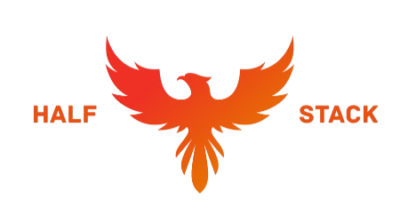

<div align="center">
    
    <br>
    <h1 align="center">Visual Compiler</h1>
    <h2 align="center">Capstone Project for <a href="https://www.epiuselabs.com/">EPI-USE Labs</a></h2>
</div>

<br>

<div align="center">
    <h3 align="center">Visual Compiler is an educational platform that demonstrates the process of compilation, abstracted from its complex nature.</h3>
</div>

<br>

<h2 align="center">Project Boards</h2>

<div align="center">
    <a href="https://github.com/orgs/COS301-SE-2025/projects/162">Frontend</a> &nbsp;|&nbsp;
    <a href="https://github.com/orgs/COS301-SE-2025/projects/171">Backend</a> &nbsp;|&nbsp;
    <a href="https://github.com/orgs/COS301-SE-2025/projects/173">Administration</a></div>
<br>

<h2 align="center">Documentation and Resources</h2>

<div align="center">
    <table style="border-width: 1px; width: 50%;">
    <tr>
        <td rowspan="3" style="border: 0;">Demo 1</td>
        <td style="border: 0;"><a href="https://www.canva.com/design/DAGomTEXSj8/9jhGyLXxfua14zX0YsJ99g/edit?utm_content=DAGomTEXSj8&utm_campaign=designshare&utm_medium=link2&utm_source=sharebutton">Presentation</a></td>
    </tr>
    <tr>
        <td style="border: 0;"><a href="https://docs.google.com/document/d/1G9_tmRu2ey8_tjJHxUbkpXQod9UxfRC2dE9HBTdta10/edit?usp=sharing">Software Requirements Specification</a></td>
    </tr>
    <tr>
        <td style="border: 0;"><a href="https://docs.google.com/document/d/1Bmq9UWzTkuA_br6hin0YsK9cVgnVuuH0H0tTJB66qKY/edit?usp=sharing">Architectural Specification</a></td>
    </tr>
    </table>
</div>

<br>

<h2 align="center">Technology Stack</h2>

<div align="center">
     &nbsp;&nbsp;&nbsp;
     &nbsp;&nbsp;&nbsp;
     &nbsp;&nbsp;&nbsp;
     &nbsp;&nbsp;&nbsp;
    
</div>

<br>

<div align="center">
    
    
    
</div>

<br>

<h2 align="center">Repository Structure</h2>

```
    ├───📁.github
    │   └───📁workflows
    ├───📁assets
    ├───📄docker-compose.yml
    ├───📁docs
    ├───📁logs
    └───📁visual-compiler
        ├───📁backend
        │   ├───📁api
        │   │   ├───📁handlers
        │   │   └───📁routers
        │   ├───📁core
        │   │   ├───📁db
        │   │   └───📁services
        │   └───📁tests
        │       ├───📁integration-tests
        │       └───📁unit-tests
        ├───📁frontend
        │   └───📁ui
        │       ├───📁.svelte-kit
        │       ├───📁src
        │       │   ├───📁lib
        │       │   └───📁routes
        │       └───📁tests
        └───📁tests
```

<br>

<h2 align="center">Half Stack Members</h2>

<table style="border-width: 1px; width: 100%;">
    <tr>
        <td style="vertical-align: middle; width: auto; border: 0; padding: 10px;">
            
        </td>
        <td style="vertical-align: middle; width: auto; border: 0; padding: 10px;">
            <h2><b style="font-size: 18px;">Sashen Inder Gajai</b></h2>
            <h3><b style="font-size: 16px;">Project Manager and Services Engineer</b></h3>
            I am a BSc Computer Science student who always strives for excellence. My interests and strengths lie in theoretical computation and data science.  I am committed to designing efficient algorithms and system architectures.
            <br>
            <br>
            <a href="https://www.linkedin.com/in/sashen-inder-gajai/">
                </a>
            <a href="https://github.com/sashen-tv">
                </a>
            <br>
        </td>
    </tr>
    <tr>
        <td style="vertical-align: middle; width: auto; border: 0; padding: 10px;">
            
        </td>
        <td style="vertical-align: middle; width: auto; border: 0; padding: 10px;">
            <h2><b style="font-size: 18px;">Shinn-Ru Hung</b></h2>
            <h3><b style="font-size: 16px;">UI Engineer and Integration Engineer</b></h3>
            I am a BSc Computer Science student experienced in building intuitive, responsive front-end interfaces and robust backend integrations. I am well-versed in git workflows, API design, and clear technical documentation.
            <br>
            <br>
            <a href="https://www.linkedin.com/in/shinn-ru-hung-au5tin-r/">
                </a>
            <a href="https://github.com/Au5tin-R">
                </a>
            <br>
        </td>
    </tr>
    <tr>
        <td style="vertical-align: middle; width: auto; border: 0; padding: 10px;">
            
        </td>
        <td style="vertical-align: middle; width: auto; border: 0; padding: 10px;">
            <h2><b style="font-size: 18px;">Tia Harripersad</b></h2>
            <h3><b style="font-size: 16px;">Services Engineer and Testing Engineer</b></h3>
            I am a BSc Computer Science student who is motivated and skilled in system integration, data structures, and quality assurance. I am experienced in debugging and performance tuning to deliver scalable, reliable software.
            <br>
            <br>
            <a href="https://www.linkedin.com/in/tia-harripersad-316143356/">
                </a>
            <a href="https://github.com/Tia-H">
                </a>
            <br>
        </td>
    </tr>
    <tr>
        <td style="vertical-align: middle; width: auto; border: 0; padding: 10px;">
            
        </td>
        <td style="vertical-align: middle; width: auto; border: 0; padding: 10px;">
            <h2><b style="font-size: 18px;">Keanu Ellary</b></h2>
            <h3><b style="font-size: 16px;">Integration Engineer and DevOps Engineer</b></h3>
            I am a BSc Information & Knowledge Systems student with full-stack development and DevOps experience. I am highly skilled in JavaScript, Java, and C#, with knowledge of CI/CD, containerization, and UML modeling.
            <br>
            <br>
            <a href="https://www.linkedin.com/in/keanu-ellary-187281355/">
                </a>
            <a href="https://github.com/Keanu-Ellary">
                </a>
            <br>
        </td>
    </tr>
    <tr>
        <td style="vertical-align: middle; width: auto; border: 0; padding: 10px;">
            
        </td>
        <td style="vertical-align: middle; width: auto; border: 0; padding: 10px;">
            <h2><b style="font-size: 18px;">Devan de Wet</b></h2>
            <h3><b style="font-size: 16px;">UI Engineer and Data Engineer</b></h3>
            I am a BSc Information & Knowledge Systems student focused on user-centric front-end design and data-driven back-end integration. I am proficient in modern JS/TS frameworks and real-time data workflows.
            <br>
            <br>
            <a href="https://www.linkedin.com/in/devan-klaassen-750681360/">
                </a>
            <a href="https://github.com/DevanDewet">
                </a>
            <br>
        </td>
    </tr>
</table>
